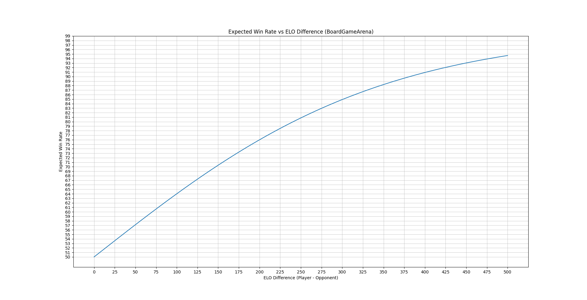
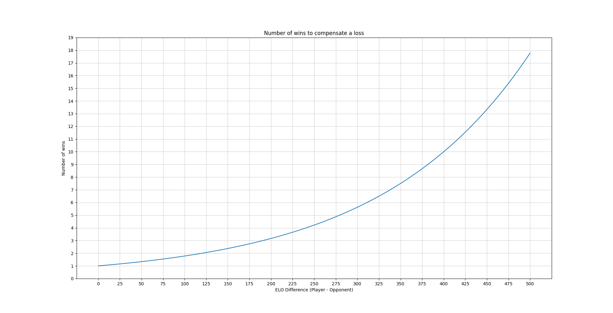
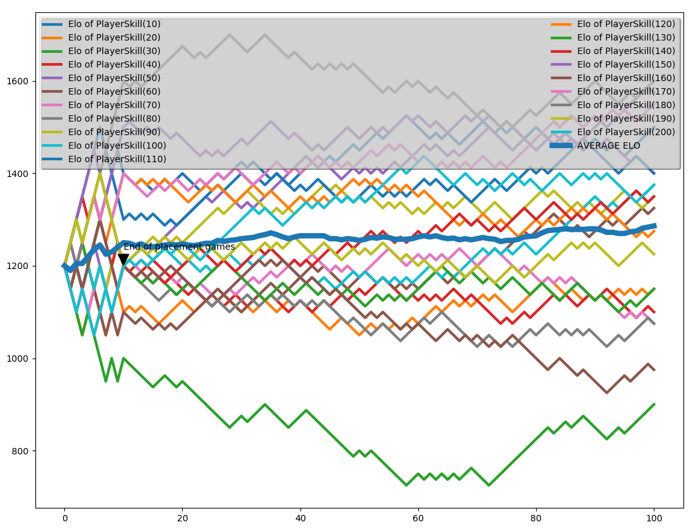

[](https://github.com/ambv/black)

## Purpose
Simulating how the Elo ranking system works in a simple Python interface 




## Install
pip install -r requirements.txt

## Usage
``` 
elo.py [-h] [--sleeptime SLEEPTIME] [--static] [-v] nb_players nb_games nb_placements min_skill delta_skill
```
Static example:
``` 
python elo.py 5 100 15 10 10 --sleeptime=5 --static
``` 
https://www.youtube.com/watch?v=dEW1x4HGTIA

Dynamic example:
``` 
python elo.py 5 10000 15 10 10 --sleeptime=0.01
``` 
https://www.youtube.com/watch?v=f_B2ISMUnVo

Adding the --elohell option changes how the program works. Instead than facing with each other, the players face fake opponents and have a fixed winrate (calculated with elo_hell.py).
```
python elo.py 20 100 10 10 10 --sleeptime=5 --static --elohell
```
Gives something like this:


## elo_hell.py
A simple brut force program to calculate the expected winrate in a theoretical "elo hell".
0.536 is the theoretical winrate of a player in elo hell defined as: 
- Any other player has a probability of ruining the game of 0.1 (a.k.a. inter)
- If both teams have an equal number of inters, then the probability of wining the game is 0.5

``` 
python elo_hell.py
``` 

